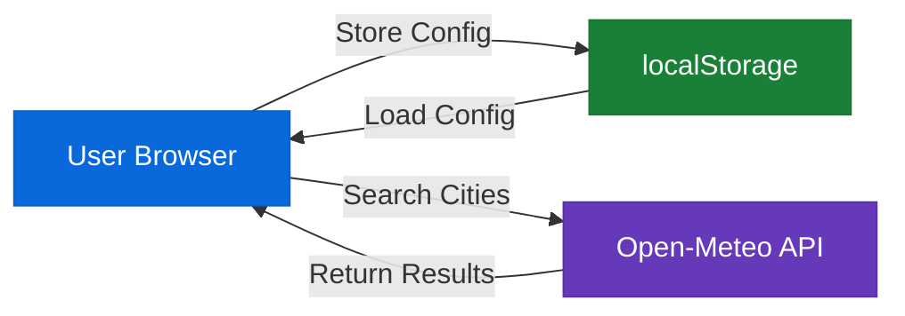
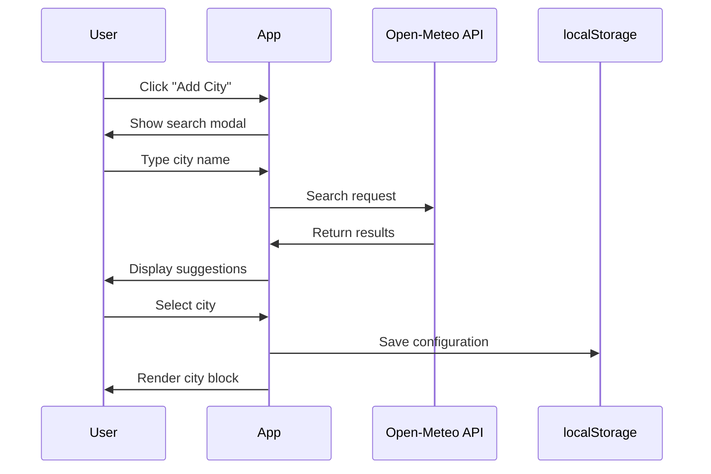
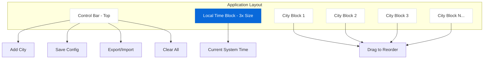

# xsukax Global Time Manager

A lightweight, privacy-focused single-page application for tracking time across multiple cities worldwide. Built with vanilla JavaScript and designed with a modern GitHub-inspired aesthetic, this tool runs entirely in your browser with zero server dependencies.

[](https://www.gnu.org/licenses/gpl-3.0)
[](https://developer.mozilla.org/en-US/docs/Web/HTML)
[](https://developer.mozilla.org/en-US/docs/Web/JavaScript)
[](https://tailwindcss.com/)

## 📋 Project Overview

xsukax Global Time Manager is a sophisticated time zone management application designed for professionals, remote teams, and anyone who needs to coordinate across multiple time zones. The application displays real-time clocks for cities worldwide, allowing users to visualize time differences at a glance.

**Core Capabilities:**
- Display local time in a prominent, always-visible block
- Add unlimited city time zones with instant search functionality
- Drag-and-drop interface for customizing city arrangement
- Persistent configuration storage using browser localStorage
- Export/import functionality for backup and cross-device synchronization
- Responsive grid layout that adapts to any screen size
- Real-time updates with accurate timezone handling including DST

## 🔒 Security and Privacy Benefits

This application is architected with privacy-by-design principles:

### Local-First Architecture
All user data is stored exclusively in the browser's localStorage, ensuring that your time zone preferences never leave your device. There is no backend server, no database, and no cloud storage—your configuration remains under your complete control.

### Minimal External Dependencies
The application uses only two external resources:
1. **Tailwind CSS CDN** - For styling, loaded from a trusted CDN with integrity checks possible
2. **Open-Meteo Geocoding API** - For city search functionality, which only receives the city name you type and returns geographic coordinates. No personal information is transmitted.

### No Tracking or Analytics
Unlike many web applications, xsukax Global Time Manager contains zero tracking scripts, analytics platforms, or third-party cookies. Your usage patterns, search queries, and time zone selections remain completely private.

### Open Source Transparency
The entire application is contained in a single HTML file, making it trivially easy to audit the complete source code. You can inspect every line to verify there are no hidden data collection mechanisms or security vulnerabilities.

### Offline Capability
Once loaded, the application functions entirely offline (except for adding new cities). Your existing time zones continue to update without any network connection, ensuring privacy and reliability.



## ✨ Features and Advantages

### Visual Design
- **GitHub-Inspired Interface**: Clean, professional design language with subtle gradients and shadows
- **Prominent Local Time Display**: Large time block (3x standard size) ensures your primary timezone is always visible
- **Luxurious Typography**: Carefully selected font weights and sizes for optimal readability

### User Experience
- **Intuitive Drag-and-Drop**: Reorder cities effortlessly by dragging one block onto another to swap positions
- **Global City Search**: Access thousands of cities worldwide through a fast, responsive search interface
- **Smart Visual Feedback**: Dashed borders and opacity changes during drag operations
- **Responsive Grid Layout**: Automatically adjusts to your screen size, from mobile to ultra-wide displays

### Technical Excellence
- **Single File Application**: No build process, no dependencies to install—just one HTML file
- **Real-Time Updates**: Clocks refresh every second with accurate timezone conversions
- **DST Awareness**: Automatically handles daylight saving time transitions
- **Persistent State**: Your configuration survives browser restarts and system reboots
- **Fast City Search**: Powered by Open-Meteo Geocoding API with sub-500ms response times

### Data Management
- **Export Configuration**: Download your city list as a JSON file for backup
- **Import Configuration**: Restore from a previously exported file with a single click
- **No Data Loss**: Explicit save button with visual confirmation ensures your changes are preserved

```mermaid
flowchart TD
    A[Launch Application] --> B{Has Saved Data?}
    B -->|Yes| C[Load Configuration]
    B -->|No| D[Show Default View]
    C --> E[Display Time Zones]
    D --> E
    E --> F[User Interactions]
    F --> G{Action Type?}
    G -->|Add City| H[Search & Select]
    G -->|Drag City| I[Reorder Position]
    G -->|Delete City| J[Remove from List]
    G -->|Export| K[Download JSON]
    G -->|Import| L[Upload JSON]
    H --> M[Save to localStorage]
    I --> M
    J --> M
    L --> M
    M --> E
    K --> E
    
    style A fill:#0969da,stroke:#0860ca,color:#fff
    style M fill:#1a7f37,stroke:#187733,color:#fff
    style E fill:#6639ba,stroke:#5930a5,color:#fff
```

## 🚀 Installation Instructions

### Method 1: Direct Download (Recommended)
1. Download the `index.html` file from this repository
2. Save it to any location on your computer
3. Double-click the file to open it in your default web browser
4. **That's it!** The application is ready to use immediately

### Method 2: Clone Repository
```bash
# Clone the repository
git clone https://github.com/xsukax/xsukax-Global-Time-Manager.git

# Navigate to the directory
cd xsukax-Global-Time-Manager

# Open in your browser
# On macOS:
open index.html
# On Linux:
xdg-open index.html
# On Windows:
start index.html
```

### Method 3: Local Web Server (Optional)
If you prefer to run the application through a local web server:

```bash
# Using Python 3
python -m http.server 8000

# Using Node.js (with http-server installed globally)
http-server -p 8000

# Then navigate to http://localhost:8000 in your browser
```

### System Requirements
- **Browser**: Any modern web browser (Chrome 90+, Firefox 88+, Safari 14+, Edge 90+)
- **Internet**: Required only for adding new cities; existing cities work offline
- **Storage**: Minimal (< 1KB for typical configurations)
- **JavaScript**: Must be enabled

## 📖 Usage Guide

### Initial Setup

When you first launch the application, you'll see:
- A large local time block displaying your current system time
- A control bar with action buttons at the top
- An empty grid ready for your city time zones

### Adding Cities

1. Click the **"+ Add City"** button in the top control bar
2. Type the name of any city in the search field
3. Wait for suggestions to appear (typically < 500ms)
4. Click on your desired city from the list
5. The city block appears immediately in the grid

**Pro Tip**: You can search by city name, and the results include state/province information for disambiguation (e.g., "Paris, Île-de-France, France").



### Rearranging Cities

1. Click and hold any city block
2. Drag it over another city block
3. You'll see visual feedback (dashed border on target, opacity on dragged block)
4. Release to swap their positions
5. Changes are saved automatically

**Note**: The local time block cannot be dragged—it always remains in the top-left position.

### Saving Your Configuration

Although the application auto-saves certain actions, it's good practice to explicitly save:
1. Click the **"💾 Save"** button after making changes
2. A green notification appears confirming the save
3. Your configuration persists across browser sessions

### Exporting Configuration

To backup your configuration or transfer it to another device:
1. Click the **"↓ Export"** button
2. A JSON file (`xsukax-time-config.json`) downloads automatically
3. Store this file securely for future use

### Importing Configuration

To restore a previously exported configuration:
1. Click the **"↑ Import"** button
2. Select your JSON file from the file picker
3. Your cities are restored immediately
4. A confirmation message appears

### Removing Cities

To delete a single city:
1. Hover over the city block
2. Click the **X** button that appears in the top-right corner
3. Confirm the deletion in the modal dialog

To remove all cities at once:
1. Click the **"Clear All"** button
2. Confirm the action in the modal dialog
3. All city blocks are removed (local time block remains)

### Understanding the Display

**Local Time Block** (Large, Purple Gradient):
- Shows your system's current time in 24-hour format
- Updates every second
- Displays the full date (e.g., "Monday, October 27, 2025")
- Cannot be removed or repositioned

**City Time Blocks** (White, Smaller):
- Display city name and country
- Show time in 24-hour format
- Include abbreviated date (e.g., "Mon, Oct 27")
- Can be dragged, reordered, and deleted



### Keyboard and Accessibility

- **Tab Navigation**: Cycle through interactive elements
- **Enter/Space**: Activate buttons
- **Escape**: Close modals (when supported by browser)
- **Drag with Mouse**: Full drag-and-drop support
- **Touch Devices**: Mobile drag-and-drop works on touchscreens

## 🔧 Technical Architecture

### Data Structure

Configuration is stored in localStorage with the following structure:

```json
{
  "cities": [
    {
      "name": "Tokyo",
      "country": "Japan",
      "timezone": "Asia/Tokyo",
      "latitude": 35.6762,
      "longitude": 139.6503
    }
  ],
  "order": [0, 1, 2],
  "savedAt": "2025-10-27T12:00:00.000Z"
}
```

### Timezone Detection

The application uses a coordinate-based timezone approximation algorithm:
- Calculates timezone offset from longitude (15° per hour)
- Maps to IANA timezone identifiers
- Falls back to UTC for edge cases

### API Integration

**Open-Meteo Geocoding API**
- Endpoint: `https://geocoding-api.open-meteo.com/v1/search`
- Response time: Typically < 500ms
- No API key required
- Returns: City name, country, coordinates, administrative regions

## 🛠️ Customization

### Modifying Colors

The application uses CSS custom properties and Tailwind classes. To customize the color scheme, edit the gradient values in the `<style>` section:

```css
/* Local time block gradient */
.local-time {
    background: linear-gradient(135deg, #0969da 0%, #6639ba 100%);
}

/* Primary button gradient */
.btn-primary {
    background: linear-gradient(180deg, #0969da 0%, #0860ca 100%);
}
```

### Changing Grid Layout

Modify the grid template in the `.grid-container` class:

```css
.grid-container {
    grid-template-columns: repeat(auto-fit, minmax(180px, 1fr));
    gap: 1rem;
}
```

## 🐛 Troubleshooting

### Cities Not Appearing in Search
- **Cause**: Slow network connection or API timeout
- **Solution**: Wait a few seconds and try again; the API has a 5-second timeout

### Configuration Not Saving
- **Cause**: Browser privacy mode or localStorage disabled
- **Solution**: Use normal browsing mode; export your config as a backup

### Incorrect Timezone Display
- **Cause**: Coordinate-based approximation may not match exact timezone
- **Solution**: The timezone detection is approximate; for critical applications, verify against authoritative sources

### Drag-and-Drop Not Working
- **Cause**: Browser compatibility or touch device issues
- **Solution**: Ensure you're using a modern browser; try with a mouse instead of touchpad

## 🤝 Contributing

Contributions are welcome! Please feel free to submit issues, feature requests, or pull requests through the GitHub repository.

### Development Workflow
1. Fork the repository
2. Create a feature branch (`git checkout -b feature/amazing-feature`)
3. Make your changes to `index.html`
4. Test thoroughly in multiple browsers
5. Commit your changes (`git commit -m 'Add amazing feature'`)
6. Push to the branch (`git push origin feature/amazing-feature`)
7. Open a Pull Request

### Code Style
- Maintain single-line CSS rules for consistency
- Use meaningful variable names
- Add comments for complex logic
- Preserve the GitHub-inspired design language

## 📄 Licensing Information

This project is licensed under the GNU General Public License v3.0.

## 🙏 Acknowledgments

- **Tailwind CSS** - For the utility-first CSS framework
- **Open-Meteo** - For the fast and free geocoding API
- **GitHub** - For design inspiration

---

**Made with ❤️ by xsukax**

For questions, issues, or suggestions, please visit the [GitHub repository](https://github.com/xsukax/xsukax-Global-Time-Manager).
